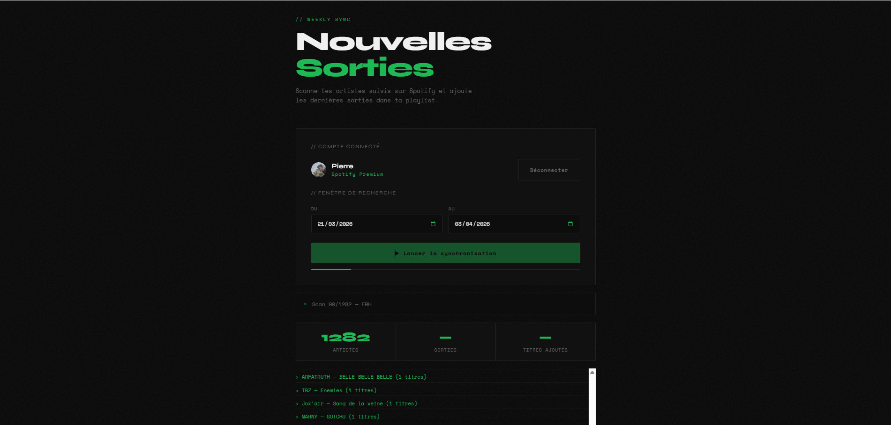

<h1 align="center">
  
</h1>

---

# Spotify New Releases — Sync · Identify · Complete

## Aperçu
Application web tout-en-un pour scanner tes artistes Spotify, identifier leurs dernières sorties et les ajouter automatiquement à ta playlist "À écouter". Aucun serveur, token stocké localement.

## Fonctionnalités
- Authentification sécurisée via OAuth 2.0 PKCE (Spotify)
- Récupération automatique des artistes suivis
- Recherche des nouvelles sorties par plage de dates personnalisée
- Ajout massif des titres à une playlist
- Interface graphique moderne avec logs en temps réel
- 100% front-end — aucune donnée ne transite par un serveur
- Tokens stockés localement dans le navigateur

## Technologies
- HTML5 / CSS3
- JavaScript (Vanilla)
- Spotify Web API
- OAuth 2.0 PKCE
- GitHub Pages

## Aperçu de l'interface

## Auteur
- [Pierre-Portfolio](https://github.com/Pierre-Portfolio/)

---

Projet réalisé en 2026.
