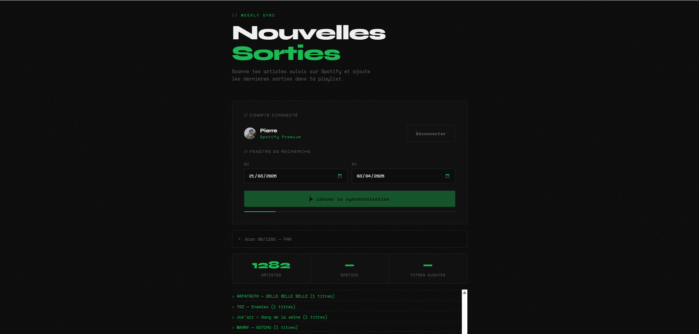

<h1 align="center">
  
</h1>


---

# Spotify+ — Nouvelles Sorties

## Aperçu
Application web **PWA sans backend** : elle scanne tes artistes Spotify suivis, détecte leurs nouvelles sorties et stocke tout **localement sur l'appareil** (sql.js + IndexedDB). Chaque artiste est scrappé depuis sa propre date de dernier scan. Tu explores ton feed, écoutes les titres un par un et les valides — aucun ajout automatique en playlist.

Au-delà de la musique, c'est un **hub perso** regroupant plusieurs modules (activables/désactivables) : Actu, Météo, Finance, Jeux, Bon Plan, TV Time, Note, To do, Maps, Mot de passe, Alertes/Remember, Stats et jeux (League of Legends).

👉 **https://pierre-portfolio.github.io/NewSpotifyRelease/** — aucune installation, tout est statique sur GitHub Pages.

## Fonctionnalités

### Synchronisation & scraping
- **OAuth 2.0 PKCE** 100 % client (paramètre `state` anti-CSRF)
- Scraping des artistes suivis, **délai configurable** (10/20/30 s) + jitter aléatoire
- **Date par artiste** : chacun est scrappé depuis sa propre `last_scraped_at` (défaut 2026-03-15), avancée **seulement si le scan réussit**
- Sorties du jour du dernier scan non ratées (cutoff au jour) ; un album dont une piste était déjà sortie en single n'est plus sauté
- **Pause / reprise** (la pause bloque vraiment tous les appels) ; **reprise après fermeture** via la progression sauvegardée (bouton « ↩ Reprendre », reprise directe sur la bonne page)
- **Protection rate-limit** : dès le 1er 429, la sync s'arrête (progression conservée) et toute l'app est bloquée 15 min mini (persiste au F5)
- **Quota 100 artistes / fenêtre glissante de 24 h** : atteindre 100 ouvre un compte à rebours, avec date + countdown affichés (carte Artistes + panneau Synchronisation) ; bouton **🔄 Réinitialiser le quota** dans À propos
- Notification navigateur en fin de session et quand le scraping redevient disponible

### Découvertes de la semaine (import hebdo auto + accès direct)
Au login, la playlist Spotify « Découvertes de la semaine » est importée dans le feed (tag violet). **Réimport automatique à chaque nouvelle semaine** (les Découvertes se rafraîchissent le lundi ; l'app mémorise la playlist lisible et la relit directement), réessai 6 h après un échec. ⚠ Depuis la migration Spotify de fév. 2026, le contenu des playlists éditoriales n'est pas toujours lisible : l'app le détecte et l'explique. **✨ Capture par la lecture** : il suffit désormais de **lancer la lecture de la playlist** (une fois par semaine) — l'app reconnaît qu'une « Découvertes de la semaine » est en cours d'écoute et **capture automatiquement les titres (courant + file d'attente) dans « En attente »**, sans copie perso ni manipulation ; les titres déjà connus/écoutés/purgés ne sont jamais réimportés. (Nouvelle permission Spotify requise : si l'app le demande dans les Logs, déconnecte-toi puis reconnecte-toi une fois.) **Bouton violet « Accéder à la playlist "Découverte de la semaine" »** (Scrapping, sous les Logs) : teste l'accès immédiatement, écrit le diagnostic détaillé dans les Logs, importe ce qui est lisible et **ouvre directement la playlist sur Spotify** (retrouvée via l'API de recherche même si elle n'est pas dans ta bibliothèque) — lance ensuite la lecture pour déclencher la capture.

### Feed & player
- File d'attente (jusqu'à 1000 titres affichés, bandeau si plus en base)
- Marquage auto écouté en fin de titre + **auto-avance** (sans voler la lecture si tu lances autre chose)
- **Bouton ×** = marque écouté + retire (→ Historique + stats), avec **↩ Annuler** 5 s ; **❤ like** par titre
- **Filtres** type / genre / artiste et **tri** (par artiste A→Z par défaut) — **balaient toute la base** (pas seulement les 1000 affichés)
- Swipe gauche = retirer, swipe droite = précédent (mobile) ; bannières de date (mobile)
- **Player** : poll 5 s (suspendu onglet caché), prev/play-pause/next, clic next → démarre à 25 %, bouton loop, barre draggable, **player mobile 50vh**, **mode compact** en split-screen

### Stats
Section dédiée avec collapses : **🎵 Musiques** (restantes, temps d'écoute restant/total, ce mois/année/all-time, % likés) · **✅ To do** (tâches terminées + ⭐ compliquées) · **🎬 Films** (films/épisodes/séries, temps, YouTube, mangas/animés, top 5 séries) · **🗺️ Maps** (distance + mode préféré) · **📈 Graphique** (écoutes & tâches sur 14 j) · **📊 Stats avancées** (top artistes, répartition) · **🎮 Jeux** (Speedrun + League of Legends + **♟️ chess.com** : élos rapide/blitz/bullet/daily, records, puzzles — API publique sans clé, juste ton pseudo — + **🕹️ Jeux Hub** en dernier : tes **records locaux** des mini-jeux de la section Jeux — meilleur score 2048/Doodle Jump/Flappy Bird/Osu/Snake, images classées en TierList, tout hors-ligne) · **🐙 GitHub**. Tout calculé en local, sans requête (sauf jeux/GitHub). **LoL sans clé** : profil, **Top ≈ X %** (soloQ), élos soloQ/flex, **collapse 🏆 Classement** regroupant tous les classements au format « rang / total » (Solo/Duo et Flex estimés par palier ; Ladder op.gg, Champions, Niveau et Maîtrises affichés quand l'API les expose, « — / — » sinon), bannière colorée « Aucune partie en cours » et **partie en cours avec l'élo, le winrate et le nombre de games de chaque joueur** via l'API op.gg (aucune clé à créer ni régénérer) ; une clé Riot peut être ajoutée en simple secours.

### Actu
Agrégateur **sans backend ni clé** (cache 30 min, ↻ Actualiser). Sources pré-récupérées par une **GitHub Action** (`data/actu.json`, proxies CORS en repli). Contient (sections par ordre alphabétique) : **📰 Actualité** (🔥 Tendances du jour en tête, puis Actu Mondial, Bourse & crypto, IA & Science + Hacker News, 🛡️ Cyber Secu — failles, ransomwares & cyberattaques —, Insolite, Jeux), **🔓 Dernières fuites de données** (bonjourlafuite → repli Have I Been Pwned, avec la **vraie icône de l'entreprise piratée** retrouvée d'après le titre — logo Wikipédia, sinon favicon du site, affiché **sur fond blanc** pour rester lisible même quand le logo est transparent), **🚇 Réseaux de Transport Paris** (carte interactive des transports franciliens intégrée, avec lien plein écran) et **▶️ Vidéos YouTube · Abonnements** (sélecteur **« ▶️ Vidéo » / « 📱 Shorts »** en tête — les Shorts < 3 min ont leur propre onglet avec compteur, **jusqu'à 100 vidéos ET 100 Shorts** —, **chargement automatique en fin de scroll** dans les deux onglets, bouton « 🕒 Plus tard » ajoute la vidéo dans une playlist YouTube dédiée). À l'ouverture d'Actu (ou d'À propos) sans compte Google connecté, l'app **demande directement l'accès Google** (un seul consentement pour YouTube ET Drive) — refus mémorisé 24 h. Chaque actu a sa vignette : la **photo de l'article** (résolue côté GitHub Action via l'og:image de la page), sinon le favicon de la source en dernier recours.

### Météo
Prévisions **Open-Meteo** (sans clé) — Light 3 j / Full 7 j. Recherche d'une ville quelconque (géocodage) + 4 lieux (Voisins-le-Bretonneux, Massy, Boulogne-Billancourt, ta position). Clic sur un jour → détail heure par heure (ressenti, pluie, vent, UV, lever/coucher).

### Finance
Données live via **APIs gratuites sans clé** (fiabilité variable). Light / Full / **Mes Actifs**. Crypto (CoinGecko), Indices NASDAQ-100/S&P 500/CAC 40 (via GitHub Action, same-origin), Stock picking (Twelve Data + repli Stooq), Matières (Pétrole/Sucre Alpha Vantage, Or/Argent gold-api), EUR/USD. **📈 Graphique au clic** sur n'importe quelle ligne (SVG maison, repli sur historique local échantillonné). **💰 Mes Actifs** = tableau de bord patrimoine lu depuis ton Google Sheets « Finance » du Drive (patrimoine net/brut, budget 50/30/20, comptes, pyramide, liberté financière…).

### Calculatrice (dans Finance)
Mode **🧮 Calculatrice** entre Full et Mes Actifs : calculatrice de poche 100 % locale (4 opérations, %, ±, historique des 5 derniers calculs), clavier physique supporté. Également **accessible dès la page de connexion** (tuile 🧮 Calculatrice de la grille de modules, aucune connexion Spotify requise).

### Jeux
🎮 **Ludothèque 100 % locale** (aucune connexion, aucun réseau) : un seul onglet avec un **menu déroulant en haut à droite** (aligné avec le titre) pour choisir parmi **17 mini-jeux** — **2048, Bataille navale, Démineur, Doodle Jump, Flappy Bird, Go (à 2 joueurs), Guitar Hero, Inposteur, Memory (à 2 joueurs), Morpion (à 2 joueurs), Motus, Osu, Piano Tiles, Puissance 4 (à 2 joueurs), Snake, TierList, UnderCoverDraw (3 à 8 joueurs)**. La Bataille navale se joue **à 2 sur le même téléphone**, chacun **plaçant lui-même ses navires** case par case (touche une case pour poser le navire, 🔄 pour le tourner, 🎲 pour un placement aléatoire) ; les autres jeux à 2 joueurs (Go, Inposteur, **Memory**, Morpion, Puissance 4) se jouent aussi **sur le même téléphone**. Au **Memory** à 2, on **choisit d'abord la taille de la grille (4×4, 6×6 ou 8×8)**, puis chacun retourne 2 cartes à son tour : une paire trouvée rapporte 1 point et rejoue, sinon la main passe ; le joueur avec le plus de paires gagne. Le **Morpion** utilise la variante « 3 pions max » : chaque joueur ne garde que ses 3 derniers symboles (le plus ancien, grisé, disparaît quand on en pose un 4ᵉ) — **il y a donc toujours un vainqueur, jamais d'égalité**. Le **Puissance 4** ajoute une mécanique façon Tetris : dès qu'une **rangée horizontale est entièrement remplie**, elle **disparaît** et tous les jetons au-dessus **descendent d'un cran**. Le **Doodle Jump** est un portage maison du jeu culte, entièrement dessiné (aucune image externe) : ton doodler **rebondit tout seul** de plateforme en plateforme, tu le diriges à gauche/droite (les bords de l'écran sont **traversants**) et tu grimpes le plus haut possible — le **score, c'est l'altitude**. On y retrouve les mécaniques d'origine : plateformes **vertes** (fixes), **bleues** (mobiles), **marron** (cassantes, on passe à travers) et **blanches** (à usage unique) ; **ressorts** et **trampolines** pour des super sauts ; **🎩 chapeau à hélice** et **🚀 jetpack** pour s'envoler ; **👾 monstres** que tu peux **détruire en tirant ou écraser en leur sautant dessus** (ça les tue et te fait rebondir) — mais tout autre contact est mortel — et **🕳️ trous noirs** ; la difficulté monte avec l'altitude. Le jeu tourne à une **vitesse plus posée** (calibré pour ne pas être trop rapide). **Tout se joue sur le plateau** (plus de boutons à l'écran) : tu **glisses le doigt** pour diriger le doodler et tu **double-cliques / double-tapes** pour **tirer** ; les **bords de l'écran sont traversants** (tu sors à droite → tu réapparais à gauche, et inversement), même au doigt. Au clavier : flèches/ZQSD + Espace. Ton altitude record est mémorisée. Le **Flappy Bird** a des **graphismes refaits fidèles au jeu d'origine** (ciel dégradé + nuages, tuyaux verts à embout, oiseau jaune qui s'incline selon sa chute, sol qui défile) et une **difficulté progressive** : la vitesse augmente légèrement **tous les 50 points**, et **au-delà de 100 points les tuyaux se mettent à bouger de haut en bas**. L'**Osu** propose une manche de **60 s** et **5 niveaux de difficulté** (du Très facile à l'Extrême : plus c'est dur, plus les cercles apparaissent vite, sont petits et disparaissent tôt). Le **Guitar Hero** fait tomber des notes sur 4 couloirs à frapper au bon moment (touches D/F/J/K ou boutons tactiles), avec lui aussi une manche de **60 s** et **5 niveaux de difficulté** (la vitesse et la fréquence des notes montent d'un cran à chaque niveau). Le **Piano Tiles** (solo, « ne touche pas la tuile blanche ») fait défiler des rangées de 4 cases vers le bas : tape uniquement les **tuiles noires** de bas en haut (touche/clic sur la colonne, ou D/F/J/K) — rater une tuile noire ou toucher une case blanche met fin à la partie. Au lancement, le plateau reste **vide pendant 1 seconde** puis les tuiles **arrivent d'en haut**, et la **difficulté monte toute seule avec le temps** : ça accélère progressivement et les rangées à **2 tuiles** deviennent de plus en plus fréquentes. Ton meilleur score est mémorisé. **UnderCoverDraw** est le **portage du projet perso** du même nom : jeu de société **dessin & déduction** façon Undercover en « passe-l'appareil » (3 à 8 joueurs, avec vos prénoms) — la majorité reçoit un mot, l'imposteur un mot **au dessin quasi identique** (base de **344 couples piégeux** en 20 catégories) ; chacun dessine son mot en croquis minimaliste sur un vrai tableau, impossible de savoir si l'on est l'imposteur avant le vote, puis l'écran de résultat révèle mot commun VS mot imposteur et le rôle de chacun. La **TierList** est désormais la **version complète du projet perso LocalTierList** : une vraie tier list à **images** — tu uploades tes images (redimensionnées et compressées en local, rien ne quitte l'appareil), puis tu les **glisses dans les rangs au doigt ou à la souris** (drag & drop tactile avec auto-scroll près des bords) — et si tu **lâches une image directement sur une autre**, elles **échangent leurs places** (pratique pour réordonner 2 photos dans un même rang) ; rangs entièrement personnalisables en mode édition (nom, couleur, ajout/suppression — les images d'un rang supprimé retournent dans la réserve), et la sauvegarde est **partagée avec l'app LocalTierList d'origine** (même stockage local). Le **Motus** est désormais la **version complète du projet perso** : choix de la longueur du mot (**6 à 9 lettres**) et de la difficulté (**5 niveaux**, gradués par fréquence d'usage réelle), **850 mots à deviner**, propositions vérifiées contre un **dictionnaire de ~125 000 mots français** (mot inconnu → secousse), première lettre offerte, code couleur Motus authentique (🟥 carré rouge bien placé · 🟡 rond jaune mal placé · 🟦 bleu absent), gestion des lettres en double et révélation animée case par case. **Nouveau mode 2 joueurs** (à choisir avant la partie) : même mot mystère pour les deux, **tour par tour** sur le même téléphone avec un écran « passe l'appareil » qui masque la grille entre chaque tour (on ne voit pas les propositions de l'autre) — le **premier à trouver le mot gagne**. Chaque jeu est jouable au clavier **et** au tactile (glissé, pavé directionnel, clavier AZERTY à l'écran pour Motus). Les records personnels sont mémorisés, ainsi que le dernier jeu ouvert. Accessible aussi **dès la page de connexion** (tuile 🎮 Jeux de la grille de modules, sans connexion Spotify).

### Vêtement
👕 **Garde-robe 100 % locale** en deux temps : le collapse **Inventaire** compte combien tu as de chaque type de vêtement (T-shirt, Chaussettes, Pantalon…) avec des boutons + / −. Chaque **+1 crée automatiquement une fiche** dans le second collapse **Mes vêtements**, qui reste **vide au départ** et se remplit tout seul : un **sous-collapse par type** présent, contenant **une fiche par vêtement** (nom, **taille**, photo, état, lieu). Supprimer une fiche (« je le jette ») diminue aussi l'inventaire d'une unité. Activable/désactivable dans le Paramétrage comme les autres modules.

### Frigo Massy
🧊 Nouveau module — **vide pour le moment**, le contenu arrivera bientôt. Activable/désactivable dans le Paramétrage comme les autres modules.

### Bon Plan
Chasseur de bons plans (refonte) : **⭐ Ma liste** en premier (suivi de prix : ☆ sur n'importe quel jeu, **prix cible** optionnel → ✓ vert quand l'offre passe dessous, rafraîchi automatiquement, inclus dans la sauvegarde), **🔥 Promos du moment** (meilleures offres jeux PC du jour via CheapShark, filtres −50 % / −75 % / AAA, vignettes — section repliée par défaut), **🎮 Recherche jeux** (~20 boutiques PC, prix ≈ EUR, + liens de recherche directe **Steam · G2A · Instant Gaming · Eneba · Kinguin · Gamivo · CDKeys** sous chaque jeu déplié ; **quand aucun résultat sur CheapShark**, le prix RÉEL en euros est désormais récupéré directement chez **Steam** — la recherche affichait souvent « — » faute de prix, c'est corrigé) et **🔎 Tous produits** (refonte : la recherche marche désormais via **4 API gratuites sans clé** — **Apple** (apps, musique, films, livres, avec prix + pochette, désormais via relais CORS car l'API Apple bloquait le navigateur), **Open Products Facts** (produits du quotidien), **Open Beauty Facts** (cosmétiques) et **Open Food Facts** (alimentaire) ; lien leDénicheur en repli pour l'électronique avec prix).

### TV Time
Suivi séries & films via **TMDB v3** (clé perso, sans plafond journalier). Recherche films+séries, ajout en À voir / En cours / Vu, **fiche détaillée** (progression saison par saison, épisodes cochables individuellement, spéciaux à part). Sections : En cours / En pause / À voir / Prochaines sorties / Vus. Labels 🍥 Manga / 🎨 Dessin animé. **▶️ Chaînes & playlists YouTube** (clé YouTube Data v3) : vidéos groupées par année, Shorts < 3 min filtrés, check auto des nouvelles vidéos. Économie de requêtes maximale (tout mis en cache à l'ajout). ↩ Retour en arrière (annule la dernière action).

### Santé
Suivi calories façon **Lifesum** : profil (poids, taille, âge, sexe, activité, objectif) → **besoin calorique quotidien** calculé (Mifflin-St Jeor) + IMC. Saisie des repas du jour par catégorie (petit-déj, déjeuner, dîner, encas), jauge de progression vers l'objectif, **historique 30 jours** des calories. **Édition rétroactive** : les repas des **7 derniers jours** restent modifiables (chips de jour dans la section + ✏️ dans l'historique). **🔎 Calories automatiques** : tape le nom d'un aliment ou d'un plat, l'app cherche ses calories dans la base ouverte **Open Food Facts** (gratuit, sans compte) et affiche les résultats — la recherche **réessaie toute seule** si la base répond mal (plus besoin de recliquer la loupe plusieurs fois) ; ajuste la **quantité en grammes** et les kcal se calculent tout seuls ; une **croix ×** efface la recherche en cours. La section **Aujourd'hui est repliable** (le total kcal du jour reste visible replié). La saisie manuelle des kcal reste possible en repli. Les **totaux quotidiens** sont sauvegardés (et exportés), la **composition des repas reste locale** (jamais dans l'export).

### Note
Prise de **notes 100 % locale**, accessible depuis les onglets **et dès la page de connexion** (tuile 🗒️ Note de la grille de modules — aucune connexion Spotify requise). Chaque note peut être **chiffrée individuellement par mot de passe** (AES-GCM 256 + PBKDF2, comme le coffre Mot de Passe) : le titre reste lisible dans la liste, le contenu est verrouillé 🔒. Notes exportables/importables (les chiffrées restent chiffrées dans la sauvegarde), module désactivable dans le Paramétrage. ⚠ Mot de passe d'une note oublié = contenu irrécupérable.

### To do
Tâches classées par échéance en carrousel (Quotidien, Aujourd'hui, semaine, mois, année, un jour). ⭐ favorites (« compliquées »). Le Quotidien repart chaque jour à 00 h.

### Maps
Visuel type « Vos trajets » Google Maps : carte Leaflet (tuiles OSM) + timeline horodatée par jour, tracés colorés par mode, lieux visités. **⚠ L'app ne trace jamais ta position** : tu importes l'export officiel de ta Timeline Google (2 formats acceptés). Import incrémental.

### Mot de Passe
Coffre d'identifiants **chiffré par un mot de passe maître** (AES-GCM 256 + PBKDF2 via Web Crypto native) — le localStorage ne contient que des données chiffrées, le mot de passe maître n'est jamais stocké. Recherche, masquage/copie, verrouillage auto (reload + inactivité 10 min), export/import chiffré. URLs assainies (pas de `javascript:`). ⚠ Mot de passe oublié = données irrécupérables.

### Alertes (Remember)
Rappels datés (rubriques fixes Administratif/Logement/Véhicule/Médecin/Travail/Finance/Sport/Anniversaire/Autre + rappels persos), heure optionnelle, badges d'urgence, **notifications** (J-30/J-7/J-1/jour J + retards) et **ajout auto au To do** à ≤ 3 j. **🛰️ Veilles Techno** : 🤖 Dependabot (alertes de sécurité de tes dépôts GitHub, token perso) et 🏁 Speedrun (runs à valider sur les jeux que tu modères, pseudo public).

### Sauvegarde & données (À propos)
- **Export / Import** JSON, complet **ou** partiel (14 exports séparés) — fusion prudente à la restauration (dates de scan jamais régressées, TV Time/Finance fusionnés…)
- **Paramétrage des modules** : un interrupteur par module active/désactive son onglet en direct ; un bouton 🏠 à côté choisit s'il apparaît sur l'accueil (**desktop ET mobile**). Ce choix est **sauvegardé dans tes exports/imports**
- **Accueil personnalisable** : la page d'accueil affiche tes modules — **Musique en premier, puis par ordre alphabétique** (grille 3 colonnes sur desktop, 2 sur mobile) — et tu choisis lesquels afficher via le bouton 🏠 du Paramétrage ; « À propos » reste une barre en bas
- **☁︎ Dropbox** (OAuth PKCE) et **△ Google Drive** (OAuth implicite) optionnels : sauvegarde complète écrasée à chaque envoi
- Proposition de sauvegarde hebdomadaire, réinitialisation mois/année automatique (mois **local**)

## Technologies
- **React 18.3.1 + Babel Standalone 7.29.7** (CDN, versions épinglées + SRI)
- **Content-Security-Policy** verrouillée : même en cas de XSS, le token Spotify ne peut être exfiltré
- **sql.js 1.10.2** (SQLite WASM) et **Leaflet 1.9.4** **auto-hébergés** dans `vendor/`
- **IndexedDB** (persistance du binaire SQLite) · Spotify Web API (refresh token avec rotation + mutex)
- **Sync Dropbox / Google Drive** optionnelles (OAuth, aucune clé secrète dans le code)
- **GitHub Pages** (hébergement statique, aucun serveur)

## Structure du projet
```
NewSpotifyRelease/
  index.html          → App complète (React 18 CDN + sql.js), tout en un fichier
  manifest.json       → Config PWA
  service-worker.js   → Cache app shell + vendor (offline, network-first)
  vendor/             → sql-wasm.js/.wasm, leaflet.js/.css (auto-hébergés)
  icon-192.png, icon-512.png
  data/               → actu.json, indices.json (générés par GitHub Actions)
  scripts/            → fetch_actu.py, fetch_indices.py
  .github/workflows/  → update-actu.yml, update-indices.yml
  CLAUDE.md           → Doc technique
```

## Schéma de la base locale (sql.js)
```sql
tracks (id, spotify_uri UNIQUE, artist_name, title, release_title, release_type,
        release_date, cover_url, duration_ms, listened, liked, listened_at, added_at)
artists_scraped (spotify_id PK, last_scraped_at, name, image_url, popularity, followers,
        genres, spotify_url, last_release_count, total_tracks_added, last_scan_status, scan_count)
stats (id=1, total_listened, listened_this_month, listened_this_year,
        last_reset_month, last_reset_year, total_listened_ms, total_liked)
purged_uris (spotify_uri PK)
```

## Requêtes locales utiles (console DevTools)
```js
dbAll("SELECT * FROM tracks WHERE listened = 0 ORDER BY id ASC LIMIT 20")
dbAll("SELECT * FROM tracks WHERE liked = 1 ORDER BY id DESC LIMIT 20")
dbGet("SELECT * FROM stats WHERE id = 1")
dbAll("SELECT * FROM artists_scraped ORDER BY last_scraped_at DESC LIMIT 10")
```

## Aperçu de l'interface


## Auteur
- [Pierre-Portfolio](https://github.com/Pierre-Portfolio/)

---

<p align="center">Projet réalisé en 2026.</p>
